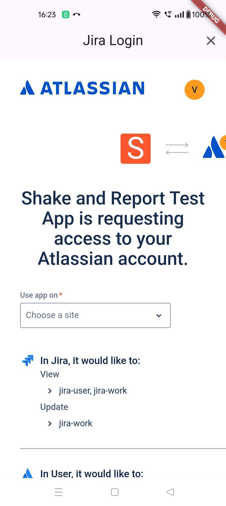
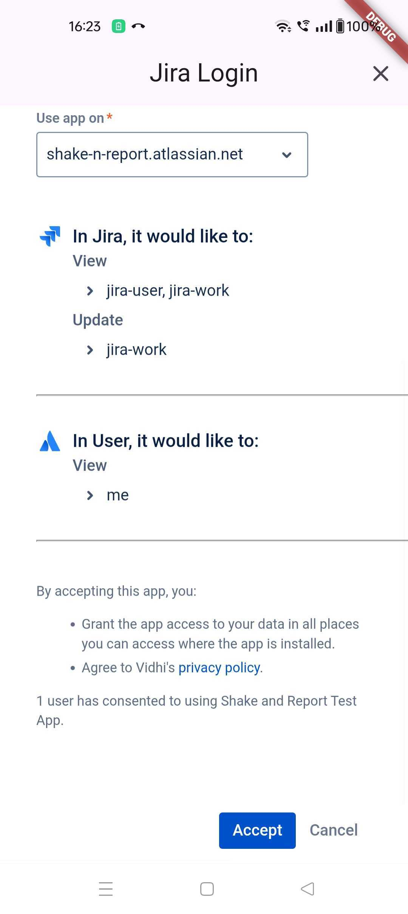
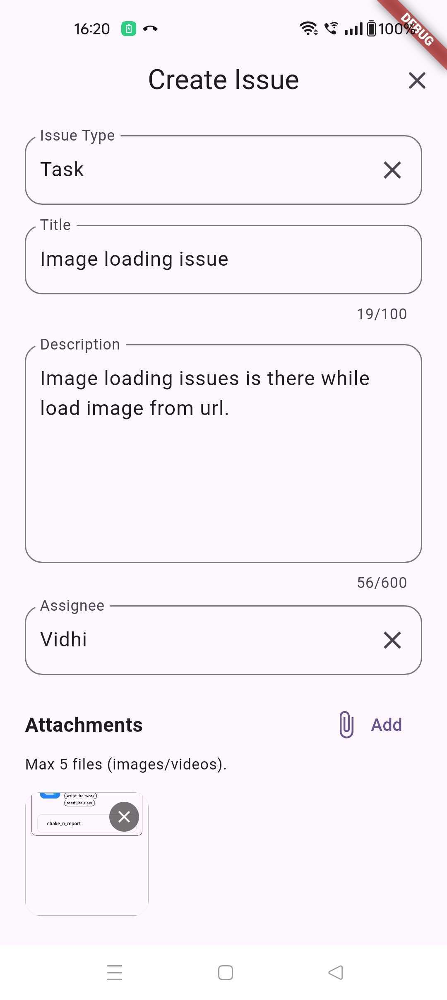
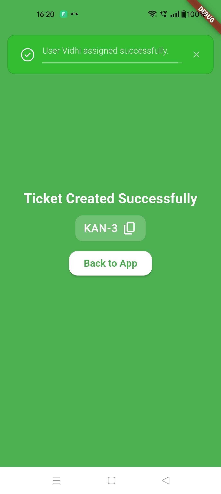

# Shake N Report

A Flutter plugin that enables users to report issues by shaking their device. This plugin integrates with various management tools like Jira to streamline the bug reporting process.

## Features

- Trigger bug report interface by shaking the device
- Customizable shake sensitivity and threshold
- Integration with Jira for issue management
- Debug mode support

## Output Screenshots






## Platform Support

- iOS
- Android

## Requirements

- Flutter 3.22.0 or higher
- iOS 11.0 or higher
- Android API level 21 or higher

## Installation

Add the following dependency to your `pubspec.yaml` file:

```yaml
dependencies:
  shake_n_report: ^latest_version
```

Run the following command to install the package:

```bash
flutter pub get
```

## Setup

### 1. Initialize the Plugin

Import the package in your main.dart file:

```dart
import 'package:shake_n_report/shake_n_report.dart';
```

Create a GlobalKey for navigation:

```dart
GlobalKey<NavigatorState> navigatorKey = GlobalKey();
```

Initialize the plugin in your `main()` function:

```dart
void main() {
  WidgetsFlutterBinding.ensureInitialized();

  ShakeToReportPlugin.initialize(
    // Required parameters
    navigatorKey: navigatorKey,
    managementTool: ManagementTools.jira,
    
    // Optional parameters
    shakeThreshold: 2, // Default: 2
    minShakeCount: 1,  // Default: 1
    isDebuggable: true, // Default: false
    
    // Jira specific configuration
    jiraConfig: JiraConfig(
      clientId: 'YOUR_CLIENT_ID',
      redirectUrl: 'YOUR_REDIRECT_URL',
      clientSecret: 'YOUR_CLIENT_SECRET',
    ),
  );

  runApp(const MyApp());
}
```

### 2. Wrap Your App

Wrap your MaterialApp with the ShakeToReportWidget:

```dart
class MyApp extends StatelessWidget {
  @override
  Widget build(BuildContext context) {
    return ShakeToReportWidget(
      child: MaterialApp(
        navigatorKey: navigatorKey,
        // ... rest of your app configuration
      ),
    );
  }
}
```

## Configuration Parameters

### Required Parameters

- `navigatorKey`: GlobalKey<NavigatorState> for navigation management
- `managementTool`: The issue management tool to use (e.g., ManagementTools.jira)

### Optional Parameters

- `shakeThreshold`: (double) Sensitivity of shake detection (default: 2.0)
- `minShakeCount`: (int) Minimum number of shakes required to trigger (default: 1)
- `isDebuggable`: (bool) Enable debug mode (default: false)

### Jira Configuration

When using Jira as the management tool, provide the following configuration:

- `clientId`: Your Jira client ID
- `redirectUrl`: The redirect URL for OAuth authentication
- `clientSecret`: Your Jira client secret

(For more information on how to obtain these credentials, refer to the [Jira Plugin Documentation](https://github.com/kombee-technologies/shake_n_report/blob/develop/jira_developer_app_setup_guide.md)).

## Usage

Once configured, users can trigger the bug report interface by shaking their device. The plugin will:

1. Detect device shake based on configured sensitivity
2. Open the bug report interface
3. Allow users to submit issues to the configured management tool

## Debug Mode

When `isDebuggable` is set to true, additional debugging information will be available in the bug report interface. This is useful during development and testing.

## Coming Soon

We will add more project management tools in future releases.

## Contributing

Contributions are welcome! Please feel free to submit a Pull Request.

## License

This project is licensed under the MIT License - see the LICENSE file for details.
